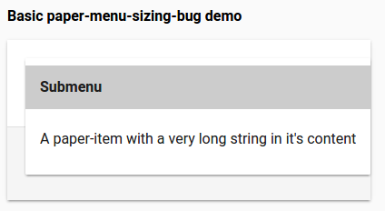
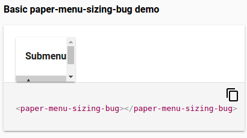

# \<paper-menu-sizing-bug\>

Demonstrates bug where paper-menu does not expand to fit submenu contents in native shadow dom

Steps to reproduce

1. polymer serve
2. Enable shadow dom; http://localhost:8082/components/paper-menu-sizing-bug/demo/index.html?dom=shadow adjust port if necessary
2. Click MENU button
3. Click submenu
4. Menu should expand to fit contents but does not 

Expected behavior (Shady DOM)



Actual behavior (Shadow DOM)



Test case included

Uses paper-menu-button, paper-menu, and paper-submenu.

## Install the Polymer-CLI

First, make sure you have the [Polymer CLI](https://www.npmjs.com/package/polymer-cli) installed. Then run `polymer serve` to serve your application locally.

## Viewing Your Application

```
$ polymer serve
```

## Building Your Application

```
$ polymer build
```

This will create a `build/` folder with `bundled/` and `unbundled/` sub-folders
containing a bundled (Vulcanized) and unbundled builds, both run through HTML,
CSS, and JS optimizers.

You can serve the built versions by giving `polymer serve` a folder to serve
from:

```
$ polymer serve build/bundled
```

## Running Tests

```
$ polymer test
```

Your application is already set up to be tested via [web-component-tester](https://github.com/Polymer/web-component-tester). Run `polymer test` to run your application's test suite locally.
